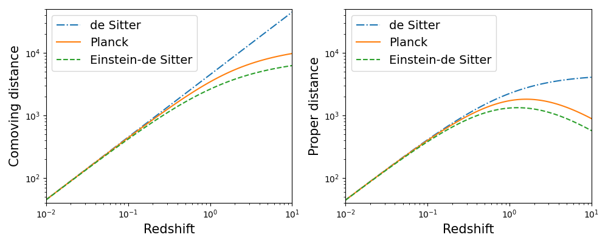

# Summary

Understanding astrophysical and cosmological processes can be challenging due to their complexity and the lack of simple, everyday analogies. To address this, we present `AstronomyCalc`, a user-friendly Python package designed to facilitate the learning of these processes and help develop insights based on the variation theory of learning [@lo2011towards; @ling2012variation].

`AstronomyCalc` enables students and educators to engage with key astrophysical and cosmological calculations, such as solving the Friedmann equations, which are fundamental to modeling the dynamics of the universe. The package allows users to construct and explore various cosmological models, including the de Sitter and Einstein-de Sitter universes [see @ryden2017introduction for more examples], by adjusting key parameters such as matter density and the Hubble constant. This interactive approach helps users intuitively grasp how variations in these parameters affect properties like expansion rates and cosmic time evolution.

Moreover, `AstronomyCalc` includes modules for generating synthetic astronomical data or accessing publicly available datasets. In its current version, users can generate synthetic Type Ia supernova measurements of cosmological distances [@vanderplas2012introduction] or utilize the publicly available Pantheon+ dataset [@brout2022pantheonplus]. Additionally, the package supports the download and analysis of the SPARC dataset, which contains galaxy rotation curves for 175 disk galaxies [@lelli2016sparc].

These datasets can be analyzed within the package to test cosmological and astrophysical models, offering a hands-on experience that mirrors the scientific research process in astronomy. `AstronomyCalc` implements simplified versions of advanced data analysis algorithms, such as the Metropolis-Hastings algorithm for Monte Carlo Markov chains [@robert2004metropolis], to explain the fundamental workings of these methods. By integrating theoretical concepts with observational data analysis, `AstronomyCalc` not only aids in conceptual learning but also provides insights into the empirical methods used in the field.

# Statement of Need

The field of astronomy and cosmology requires a deep understanding of complex processes that are often difficult to visualize or grasp through traditional learning methods. `AstronomyCalc` addresses this challenge by offering an interactive, user-friendly tool that bridges the gap between theoretical knowledge and practical application.

Designed with the variation theory of learning in mind, this package enables students and educators to experiment with and explore key astrophysical and cosmological models in an intuitive manner. By varying parameters and observing the resulting changes, users can develop a more profound understanding of the underlying physical processes.

Furthermore, `AstronomyCalc` equips users with the tools needed to analyze real or simulated astronomical data, thereby providing a comprehensive learning experience that reflects the true nature of scientific inquiry in astronomy. This makes `AstronomyCalc` an invaluable resource for education in astronomy and cosmology, enhancing both the depth and quality of learning in these fields.

# Usage Example

To illustrate the functionality of `AstronomyCalc`, we will estimate cosmological distances in different model universes. Specifically, we will consider a dark energy-dominated universe (de Sitter model), a matter-dominated universe (Einstein-de Sitter model), and a universe based on the cosmology inferred from cosmic microwave background radiation measurements by the Planck satellite.

```python
import numpy as np 
import matplotlib.pyplot as plt
import AstronomyCalc as astro

# Redshift bins
zarr = np.logspace(-2, 1, 100)

# Einsten-de Sitter universe
cosmo_dict = {'Om': 1.0, 'Or': 0, 'Ok': 0, 'Ode': 0, 'h': 0.67}
param_EdS = astro.param(cosmo=cosmo_dict)

cdist_EdS = astro.comoving_distance(param_EdS, zarr)
pdist_EdS = astro.proper_distance(param_EdS, zarr)

# de Sitter universe
cosmo_dict = {'Om': 0.0, 'Or': 0, 'Ok': 0, 'Ode': 1.0, 'h': 0.67}
param_dS = astro.param(cosmo=cosmo_dict)

cdist_dS = astro.comoving_distance(param_dS, zarr)
pdist_dS = astro.proper_distance(param_dS, zarr)

# Benchmark model or Planck universe
cosmo_dict = {'Om': 0.31, 'Or': 0.0, 'Ok': 0.0, 'Ode': 0.69, 'h': 0.67}
param = astro.param(cosmo=cosmo_dict)

cdist = astro.comoving_distance(param, zarr)
pdist = astro.proper_distance(param, zarr)

# Plots
fig, axs = plt.subplots(1,2,figsize=(10,4))
axs[0].loglog(zarr, cdist_dS, ls='-.', label='de Sitter')
axs[0].loglog(zarr, cdist, ls='-', label='Planck')
axs[0].loglog(zarr, cdist_EdS, ls='--', label='Einstein-de Sitter')
axs[0].legend(loc=2, fontsize=14)
axs[0].set_xlabel('Redshift', fontsize=15)
axs[0].set_ylabel('Comoving distance', fontsize=15)
axs[0].axis([0.01,10,40,5e4])

axs[1].loglog(zarr, pdist_dS, ls='-.', label='de Sitter')
axs[1].loglog(zarr, pdist, ls='-', label='Planck')
axs[1].loglog(zarr, pdist_EdS, ls='--', label='Einstein-de Sitter')
axs[1].legend(loc=2, fontsize=14)
axs[1].set_xlabel('Redshift', fontsize=15)
axs[1].set_ylabel('Proper distance', fontsize=15)
axs[1].axis([0.01,10,40,5e4])

plt.tight_layout()
plt.show()

```

In Figure 1, we show the plot produced by the examples discussed above. To understand the impact of the universe's expansion, we define two important distances: comoving distance and proper distance. The comoving distance represents how far apart two galaxies are, accounting for the universe's expansion over time, and remains constant for objects moving with the Hubble flow. In contrast, proper distance is what you would measure if you could "freeze" the universe at a specific moment and measure the physical separation between two objects, which changes as the universe expands. 



In the Einstein-de Sitter and Planck models, the proper distance exhibits a turnover at high redshifts because, in the early universe, it was much smaller and denser. As we look further back in time (to higher redshifts), the proper distance between objects becomes shorter, reflecting the universe's smaller scale. Thus, although proper distance generally increases with redshift due to the universe's expansion, it reaches a peak and then decreases at very high redshifts, corresponding to a time when the universe was much more compact. In contrast, in the de Sitter universe, we do not observe a strong turnover as the expansion rate is consistently very high.

# Acknowledgements

We acknowledge the higher education teaching and learning courses offered by Stockholm University. Nordita is supported in part by NordForsk.

# References
